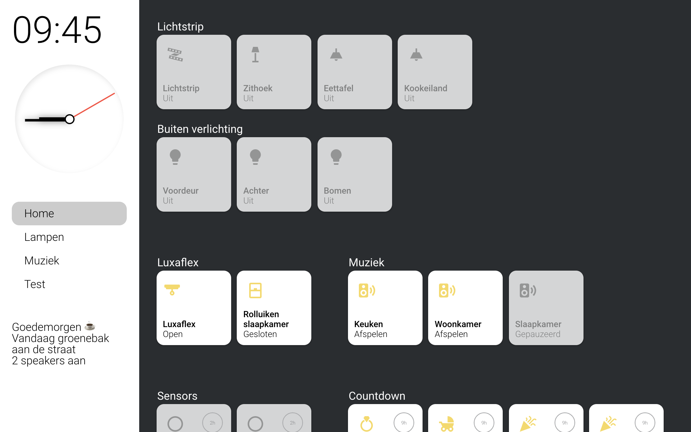

[](https://github.com/custom-components/hacs)

# Sidebar card [WIP]
This card adds a sidebar to your interface which you can configure globally so every page has the sidebar. It can replace your top navigation but can also give extra functionality.

<a href="https://www.buymeacoffee.com/ZrUK14i" target="_blank"></a>

## Installation instructions

**HACS installation:**
Go to the hacs store and use the repo url `https://github.com/DBuit/sidebar-card` and add this as a custom repository under settings.

Add the following to your ui-lovelace.yaml:
```yaml
resources:
  url: /hacsfiles/sidebar-card/sidebar-card.js
  type: module
```

**Manual installation:**
Copy the .js file from the dist directory to your www directory and add the following to your ui-lovelace.yaml file:

```yaml
resources:
  url: /local/sidebar-card.js
  type: module
```

## Configuration

The YAML configuration happens at the root of your Lovelace config under sidebar: at the same level as resources: and views:. Example:

```
resources:
  - url: /local/sidebar-card.js?v=0.0.1
    type: module   
sidebar:
  title: "Sidebar title"
views:
....
```

### Main Options

Under sidebar you can configure the following options:

| Name | Type | Default | Supported options | Description |
| -------------- | ----------- | ------------ | ------------------------------------------------ | --------------------------------------------------------------------------------------------------------------------------------------------------------------------------------------------------------------------------------------------------------------------------------------------------------------------------------------------- |
| `title` | string | optional | `Title` | Title to show in the sidebar |
| `clock` | boolean | optional | `true` | Show analog clock in sidebar |
| `digitalClock` | boolean | optional | `true` | Show digital clock in sidebar |
| `digitalClockWithSeconds` | boolean | optional | `true` | If digitalClock is enabled you can also enable to show seconds |
| `twelveHourVersion` | boolean | optional | `false` | If digitalClock is enabled you can also enable this to 12 hour version |
| `period` | boolean | optional | `false` | If twelveHourVersion is enabled you can enable this to show 'AM' or 'PM' |
| `date` | boolean | optional | `false` | If date is enabled it will display the current date |
| `dateFormat` | boolean | string | `DD MMMM` | If date is enabled you define how it should show the date with dateFormat, to see the options check this url: https://momentjs.com/docs/#/parsing/string-format/ |
| `width` | object | optional | see info below | The width of the sidebar in percentages for different screens |
| `hideTopMenu` | boolean | optional | `true` | Hide the top home assistant menu |
| `hideHassSidebar` | boolean | optional | `true` | Hide the home assistant sidebar |
| `showTopMenuOnMobile` | boolean | optional | `true` | If you hide the top menu you can set this to `true` so that it will be shown on mobile |
| `breakpoints` | object | optional | see info below | For the width we set different sizes for different screens with breakpoints you can overwrite these breakpoints |
| `sidebarMenu` | object | optional | see info below | Create a menu that can switch to different pages but also call any service you want |
| `template` | template | optional | see info below | Template rules that will show messages to inform you for example with how many lights are on |
| `style` | css | optional | see info below | Overwrite some color variables or write your own styles |
| `bottomCard` | object | optional | see info below | Define any card that will be rendered at the bottom of the sidebar |
| `hideOnPath` | array | optional | - /lovelace/camera | If you don't want the sidebar on every path you can add a list of paths where it should hide the sidebar |


When using hideTopMenu and/or hideHassSidebar you can disable this by adding `?sidebarOff` to the url.
For example you get this url: https://myhomeassistant.duckdns.org/lovelace/home?sidebarOff

##### Width

The width of the sidebar can be controlled default it will be `25%` of the width on all screens.
with the `width` option you can set the width for 3 sizes mobile, tablet and desktop.
You can also set the width to 0 to make the sidebar not appear.

Example to set width (This example hides the sidebar on mobile):

```
sidebar:
  width:
    mobile: 0
    tablet: 25
    desktop: 20
```

##### Breakpoints

Above we have set the width for 3 sizes but you can also set the breakpoints for these sizes to change the moment it changes.
the breakpoint is activated when the width is smaller or equal to the value that is set.
Default mobile is 768px or smaller, tablet 1024px or smaller and above 1024 is desktop.

Example to set breakpoints:

```
sidebar:
  breakpoints:
    mobile: 768
    tablet: 1024
```

##### sidebarMenu

To add a menu to the sidebar you can use `sidebarMenu`.
within the sidebarMenu you can add actions which will show as menu items.
Below the table with options for these actions

**Action options**

| Name | Type | Default | Supported options | Description |
| ----------------- | ------ | -------- | ---------------------------------------------------------------- | -------------------------------------------------------------------------------------------------------- |
| `action` | string | `toggle` | `more-info`, `toggle`, `call-service`, `none`, `navigate`, `url` | Action to perform |
| `entity` | string | none | Any entity id | **Only valid for `action: more-info` and `action: toggle`** to call `more-info` pop-up for this entity or `toggle` this entity |
| `navigation_path` | string | none | Eg: `/lovelace/0/` | Path to navigate to (e.g. `/lovelace/0/`) when action defined as navigate |
| `url_path` | string | none | Eg: `https://www.google.fr` | URL to open on click when action is `url`. The URL will open in a new tab |
| `service` | string | none | Any service | Service to call (e.g. `media_player.media_play_pause`) when `action` defined as `call-service` |
| `service_data` | object | none | Any service data | Service data to include (e.g. `entity_id: media_player.bedroom`)|
| `icon` | string | none | Any icon `mdi:...` | Display icon besided the name |
| `state` | string | none | Any entity `light.demo` | Set an entity (light, switch etc.) and when this entities state is on the item will display on and when it is off it will be displayed off |

When you use the `navigation` action type (see example below) and set the navigation_path to the lovelace views it will act as a normal menu and display an active state when you are on the url you defined in the sidebarMenu.

```
sidebar:
  sidebarMenu:
    - action: navigate
      navigation_path: "/lovelace/home"
      name: "Home"
      active: true
    - action: navigate
      navigation_path: "/lovelace/lampen"
      name: "Lampen"
    - action: navigate
      navigation_path: "/lovelace/music"
      name: "Muziek"
    - action: navigate
      navigation_path: "/lovelace/4"
      name: "Test"
    - action: toggle
      entity: light.beganegrond
      name: Lichtstrip
      state: light.beganegrond
      icon: mdi:led-strip-variant
```

##### template

The `template` option give you a place to template a list of messages than can be shown.
Every message must start with `<li>` and end with `</li>` within you can template your message.

Below some examples i have to say Goedemorgen == Good morning for non dutch people 
Or display how much lights or media_players are on etc.

```
sidebar:
  template: |
    <li>
       Goede nacht {{'\U0001F634'}}
       Goedemorgen {{'\u2615\uFE0F'}}
       Goedenmiddag {{'\U0001F44B\U0001F3FB'}}
       Goedenavond {{'\U0001F44B\U0001F3FB'}}
    </li>
     <li>Vandaag groenebak aan de straat</li> 
     <li>Vandaag oudpapier aan de straat</li> 
     <li>Vandaag plastic aan de straat</li> 
     <li>Vandaag grijzebak aan de straat</li> 
     <li>Morgen groenebak aan de straat</li> 
     <li>Morgen oudpapier aan de straat</li> 
     <li>Morgen plastic aan de straat</li> 
     <li>Morgen grijzebak aan de straat</li> 
     <li>{{states('sensor.current_lights_on')}} lampen aan</li> 
     <li>{{states('sensor.current_media_players_on')}} speakers aan</li> 
```

##### style

Default there are some variables that you can set to changes colors.
Of course you can also add your own styles to customize it more.
Below in the example you can find the variables with the default colors

Example:

```
sidebar:
  style: |
    :host {
        --sidebar-background: #FFF;
        --sidebar-text-color: #000;
        --face-color: #FFF;
        --face-border-color: #FFF;
        --clock-hands-color: #000;
        --clock-seconds-hand-color: #FF4B3E;
        --clock-middle-background: #FFF;
        --clock-middle-border: #000;
    }

```

##### Bottom custom card

To start add `bottomCard` to your sidebar config.
`bottomCard` got 3 parts.

1. The card `type` this can be default home assistant card or any custom card.
2. `cardOptions` most cards need some configuration for example an entity this should be placed under `cardOptions`.
3. `cardStyle` to make sure the card fits your sidebar style you can add extra CSS rules for the card to make it fit better. This is optional!

Example:

```
sidebar:
  bottomCard:
    type: horizontal-stack
    cardOptions:
      cards:
        - type: "custom:button-card"
          color_type: card
          color: rgb(255, 255, 255)
          icon: mdi:home
        - type: "custom:button-card"
          color_type: card
          color: rgb(255, 255, 255)
          icon: mdi:lightbulb
    cardStyle: |
      :host {
        width: 100%;
        background-color:#FFF;
      }
```

### Screenshots


